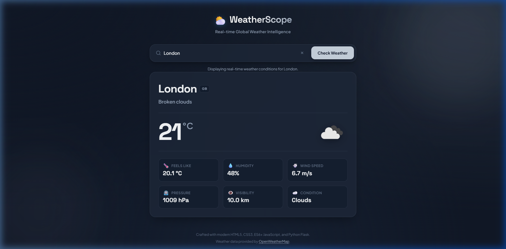

# Weather App

A lightweight, modern, and secure full-stack weather intelligence dashboard built with vanilla web standards and a Python Flask backend. The application delivers real-time weather analytics, comprehensive atmospheric metrics, and dynamic themes while strictly protecting sensitive API credentials server-side.

## Preview



> **Note**: To display your own preview screenshot here, capture your application window and save it to `assets/screenshots/weather-app-preview.png` (see [`assets/README.md`](assets/README.md) for details).

---

## Features

- **Global City Search**: Query real-time weather conditions for any city worldwide.
- **Atmospheric Metric Dashboard**:
  - Live Temperature (&deg;C)
  - "Feels Like" Perceived Temperature (&deg;C)
  - Weather Condition & Descriptive Summary
  - Humidity Percentage (%)
  - Wind Speed (m/s)
  - Atmospheric Pressure (hPa)
  - Visibility Range (km)
  - Official OpenWeather Condition Artwork
- **Dynamic Atmospheric Theming**: Adaptive background palettes that transition automatically based on current weather conditions (Clear, Clouds, Rain, Storm, Snow, Mist).
- **Responsive Architecture**: Built mobile-first, ensuring fluid rendering from 320px smartphones to 4K ultra-wide displays.
- **Robust Error Handling**: Meaningful feedback for empty inputs, invalid city names, upstream service errors, and connectivity failures.
- **Accessible Design (WCAG 2.1 AA)**: Keyboard navigable, semantic HTML5 structure, ARIA live region status alerts, and contrast-compliant typography.
- **Zero Client-Side Secret Exposure**: All external third-party API communications are strictly proxied through the Flask backend.

---

## Tech Stack

### Frontend
- **HTML5**: Semantic document layout with ARIA landmarks.
- **CSS3**: Vanilla CSS design tokens (`:root`), Flexbox, CSS Grid, `clamp()` responsive fluid typography, and glassmorphism styling.
- **JavaScript (ES6+)**: Modular vanilla JavaScript utilizing `fetch`, `async`/`await`, and safe DOM manipulation (`textContent`).

### Backend
- **Python 3**: Runtime engine.
- **Flask**: Micro-web framework providing static asset delivery and REST API routing.
- **python-dotenv**: Secure environment variable configuration.
- **Requests**: Resilient HTTP client with built-in network timeouts.

### Weather Provider
- **OpenWeatherMap API**: Free Tier Current Weather Data API.

---

## Project Structure

```
Weather-App/
├── frontend/
│   ├── index.html          # Semantic HTML5 user interface
│   ├── css/
│   │   └── style.css       # Design tokens, responsive layouts, and themes
│   └── js/
│       └── script.js       # Client application logic and API integration
│
├── backend/
│   ├── app.py              # Flask server and API proxy
│   ├── requirements.txt    # Pinned Python dependencies
│   ├── .env.example        # Environment variable template
│   └── .env                # Local secrets (strictly gitignored)
│
├── assets/
│   ├── screenshots/
│   │   └── .gitkeep        # Screenshot placeholder
│   └── README.md           # Asset and screenshot guidelines
│
├── .gitignore              # Git ignore rules for Python, IDE, and secrets
├── README.md               # Project documentation
└── LICENSE                 # MIT License
```

---

## How It Works

```
┌─────────────────┐       GET /api/weather?city=London       ┌─────────────────┐
│                 │ ───────────────────────────────────────> │                 │
│ Browser Client  │                                          │  Flask Backend  │
│ (Vanilla JS)    │ <─────────────────────────────────────── │  (Python 3)     │
└─────────────────┘              Normalized JSON             └────────┬────────┘
                                                                      │
                                                Proxied Request with  │ Secret API Key
                                                & 8s Timeout          ▼
                                                             ┌─────────────────┐
                                                             │  OpenWeatherMap │
                                                             │  External API   │
                                                             └─────────────────┘
```

1. **User Interaction**: The user enters a city name into the accessible search input and submits the form.
2. **Proxied Request**: The frontend issues a `fetch` request exclusively to the local Flask backend endpoint (`/api/weather?city={city}`).
3. **Secure API Calling**: The Flask backend injects the private `WEATHER_API_KEY` stored securely in the server environment, query parameters, and executes a timeout-bounded HTTP request to OpenWeatherMap.
4. **Data Normalization**: Flask processes the response, extracts relevant metrics, normalizes units (e.g. converting visibility from meters to kilometers), and handles any upstream error codes.
5. **Safe Rendering**: The normalized payload is returned to the client as clean JSON, and the browser updates the DOM securely using `textContent` and SVG condition icons.

---

## Prerequisites

- **Python**: Version 3.10 or higher
- **Git**: Version 2.x or higher
- **Web Browser**: Modern standard browser (Chrome, Firefox, Safari, Edge)
- **OpenWeatherMap API Key**: Free registration at [OpenWeatherMap](https://openweathermap.org/api)

---

## Installation

### 1. Clone Repository
```bash
git clone https://github.com/bhabakjishnu/Weather-App.git
cd Weather-App
```

### 2. Create and Activate Virtual Environment

**On Windows (PowerShell):**
```powershell
python -m venv .venv
.\.venv\Scripts\Activate.ps1
```

**On Windows (Command Prompt):**
```cmd
python -m venv .venv
.\.venv\Scripts\activate.bat
```

**On macOS / Linux:**
```bash
python3 -m venv .venv
source .venv/bin/activate
```

### 3. Install Dependencies
```bash
pip install -r backend/requirements.txt
```

---

## Environment Variables

Create a `.env` configuration file inside the `backend/` directory:

```bash
# Copy the provided template
cp backend/.env.example backend/.env
```

Open `backend/.env` in your editor and insert your OpenWeatherMap API key:

```env
WEATHER_API_KEY=your_actual_api_key_here
PORT=5000
FLASK_DEBUG=False
```

> **Security Rule**: The `.env` file contains sensitive private keys and must **never** be committed to version control. The repository `.gitignore` automatically blocks `.env` files from Git tracking.

---

## Running the Application

Ensure your virtual environment is active, then execute the Flask server:

```bash
python backend/app.py
```

The terminal will confirm:
```
Weather app starting at http://127.0.0.1:5000
```

Open your web browser and navigate to:
```
http://127.0.0.1:5000
```

---

## API Endpoint Reference

### `GET /api/weather`

Fetches normalized atmospheric weather data for a specified municipality.

#### Request Parameters
| Parameter | Type   | Required | Description                     |
|-----------|--------|----------|---------------------------------|
| `city`    | string | Yes      | Name of the municipality or city |

#### Example Request
```http
GET /api/weather?city=London HTTP/1.1
Host: 127.0.0.1:5000
Accept: application/json
```

#### Successful Response (`200 OK`)
```json
{
  "ok": true,
  "data": {
    "city": "London",
    "country": "GB",
    "condition": "Clouds",
    "description": "Broken clouds",
    "temperature": 18.5,
    "feels_like": 17.8,
    "humidity": 65,
    "pressure": 1014,
    "wind_speed": 4.2,
    "visibility_km": 10.0,
    "icon_code": "04d"
  }
}
```

#### Error Response (`404 Not Found`)
```json
{
  "ok": false,
  "error": "City 'Atlantis' not found. Please check the spelling."
}
```

---

## Error Handling

The application maps server and client anomalies to standardized, friendly alerts:

| Condition | Status Code | User-Facing Message |
|-----------|-------------|---------------------|
| Missing / Blank City | `400 Bad Request` | "Please enter a city name before searching." |
| City Not Found | `404 Not Found` | "City '{name}' not found. Please check the spelling." |
| Upstream Rate Limit | `429 Too Many Requests` | "Weather service rate limit exceeded. Please wait a moment." |
| Missing Server Key | `500 Server Error` | "Server configuration error: Weather API key is not configured." |
| Network Timeout | `504 Gateway Timeout` | "Weather service request timed out. Please try again." |
| Backend Unreachable | Client Catch | "Unable to connect to the weather backend. Please verify the Flask server is running." |

---

## Responsive Design

The interface conforms to a mobile-first philosophy with responsive testing across key viewports:

- **Mobile (320px - 480px)**: Compact single-column card layout, accessible touch targets (min 48px).
- **Tablet (481px - 768px)**: 2-column atmospheric metrics grid with fluid type scaling.
- **Laptop & Desktop (769px - 1440px+)**: 3-column metric cards, centered content container (max 820px), subtle ambient background depth.

---

## Accessibility

Built to conform to **WCAG 2.1 Level AA** standards:

- **Screen Reader Announcements**: Dedicated `role="alert"` with `aria-live="assertive"` for instantaneous error reporting and `role="status"` with `aria-live="polite"` for non-disruptive feedback.
- **Keyboard Navigation**: Full tab sequence with distinct `:focus-visible` styling on all interactive controls.
- **Color Contrast**: Compliant foreground-to-background contrast across all atmospheric themes.
- **Reduced Motion**: Respects system preferences via `@media (prefers-reduced-motion: reduce)`.

---

## Security Architecture

- **Server-Side Secret Custody**: The API key is stored strictly on the server in `backend/.env`. It is never delivered to or accessible by client-side JavaScript.
- **Input Sanitization**: Query inputs are validated on both the client and server to prevent parameter pollution or excessive length attacks.
- **Safe DOM Injection**: All UI dynamic fields are updated using `textContent`, mitigating Cross-Site Scripting (XSS).
- **Git Security**: Comprehensive `.gitignore` configuration guarantees that secrets, build caches, and virtual environments are excluded from version control.

---

## Future Improvements

- [ ] 5-day / 3-hour extended weather forecast timeline.
- [ ] Geolocation integration for one-click "Current Location" weather detection.
- [ ] Favorite / pinned cities with local storage persistence.
- [ ] Metric (&deg;C, m/s) and Imperial (&deg;F, mph) unit toggle.
- [ ] Interactive air quality index (AQI) metric card.
- [ ] Severe weather alerts integration.

---

## License

This project is licensed under the terms of the [MIT License](LICENSE).
